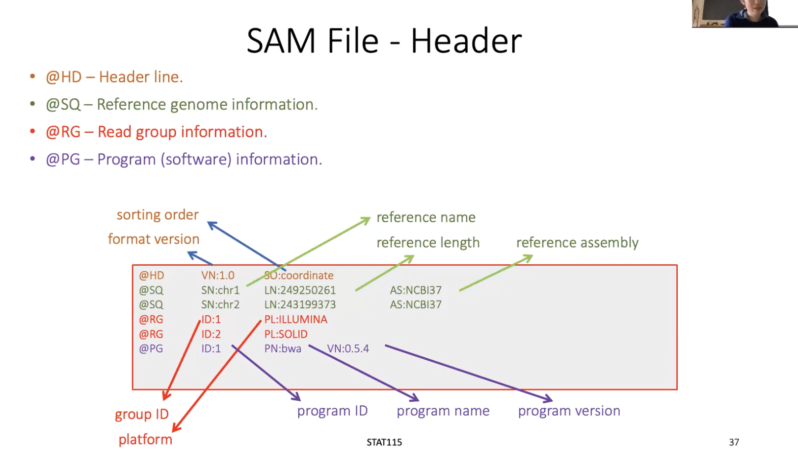

## Understanding bam file

# Example
I included an example to show the first 10 rows of a BAM/SAM file in [bam.csv](../data/bam.csv), before that, let me introduce some widely used samtools command


```bash
conda install -c bioconda samtools
samtools sort sample.bam -o sample.sorted.bam
samtools index sample.sorted.bam
samtools view sample.sorted.bam | head -n 5
samtools view -H sample.sorted.bam   # for the header
```

# pysam
`pysam` created an interface to manipulate the bam file

1. Reading

```python
import os
import pysam
import sys

bamfile = pysam.AlignmentFile('Hs-Gmp26.bam','rb')  # class 'pysam.libcalignmentfile.AlignmentFile'
iter = bamfile.fetch('chr1')  # class 'pysam.libcalignmentfile.IteratorRowRegion'
for x in iter:   # class 'pysam.libcalignedsegment.AlignedSegment' for each x
    print(x.template_length)
    # print(x.to_dict())
    '''
    {'name': 'D3LH75P1:611:AHAC40ADXX:2:2208:7351:7116',  # query_name
     'flag': '73',   # flag, and a lot of handy function to know whether it is pair, read1, and even its mate read
     'ref_name': 'chr1', # reference_name, it is different from reference_id, which will be 0
     'ref_pos': '14409', # original value in bam is 1 based, leftmost aligned residue, but reference_start will be 0 based, reference_end is the one past the last aligned residue
     'map_quality': '1', # mapping_quality
     'cigar': '75M',  # cigarstring or cigartuples
     'next_ref_name': '*',  # next_reference_name
     'next_ref_pos': '0',    # next_reference_start
     'length': '0',   # template_length
     'seq': 'GCTCAGTTCTTTATTGATTGGTGTGCCGTTTTCTCTGGAAGCCTCTTAAGAACACAGTGGCGCAGGCTGGGTGGA',  # query_sequence
     'qual': '@CCFFFFFHHHHHJJJJJJJJCGFGHGIFHIJJJJIJJIJIHJJJJJJJIIJIIJJIFHGIIJIFDDFFFD>A@B', # query_qualities
     'tags': ['AS:i:0', 'XN:i:0', 'XM:i:0', 'XO:i:0', 'XG:i:0', 'NM:i:0', 'MD:Z:75', 'YT:Z:UU', 'XS:A:-', 'NH:i:3', 'CC:Z:chr12', 'CP:i:91142', 'HI:i:0']}  # get_tag or get_tags

    # soft-clip makes things a bit more complicated
    query_alignment_seqeunce
    query_alignment_qualities
    query_alignment_start
    query_alignment_end
    query_alignment_length

    '''
    sys.exit('stop')

```

# Header



# resorces
1. [Format definition, Wiki](https://en.wikipedia.org/wiki/SAM_(file_format))
2. [soft and hard clip, padded](https://davetang.org/wiki/tiki-index.php?page=SAM)


