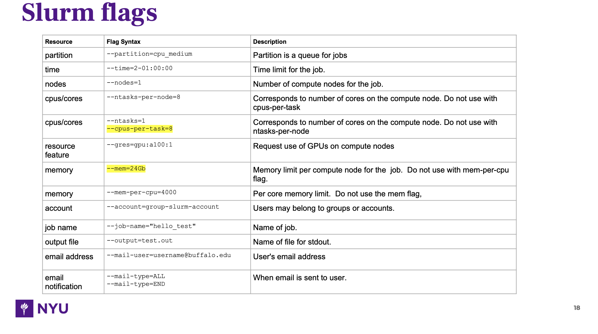

# Note for using NYU bigpurple cluster (Slurm)

## Access and VPN

You need to first get your kerberos ID and email, then you apply for HPC cluster access.

You need to set up your VPN following this [tutorial](https://servicecatalog.nyumc.org/Pages/NYU_Langone_Advanced_Access_App.aspx).


## Connect

```bash
ssh kid@bigpurple.nyumc.org

# home
/gpfs/home/lig08

# scratch
/gpfs/scratch/lig08

# lab drive (10TB for free, after reaching limit either size or number of file, resort to cold or esolong system)
# you can initiate disaster recovery by contact IT, snapshot preserve for 45 days
/gpfs/data/yarmarkovichlab

```

System is like below:

```
NAME="Red Hat Enterprise Linux Server"
VERSION="7.9 (Maipo)"
ID="rhel"
ID_LIKE="fedora"
VARIANT="Server"
VARIANT_ID="server"
VERSION_ID="7.9"
PRETTY_NAME="Red Hat Enterprise Linux"
ANSI_COLOR="0;31"
CPE_NAME="cpe:/o:redhat:enterprise_linux:7.9:GA:server"
HOME_URL="https://www.redhat.com/"
BUG_REPORT_URL="https://bugzilla.redhat.com/"

REDHAT_BUGZILLA_PRODUCT="Red Hat Enterprise Linux 7"
REDHAT_BUGZILLA_PRODUCT_VERSION=7.9
REDHAT_SUPPORT_PRODUCT="Red Hat Enterprise Linux"
REDHAT_SUPPORT_PRODUCT_VERSION="7.9"
```

## scheduler (Slurm)

```bash
# check all partition(queue) and the nodes
# please refer to http://bigpurple-ws.nyumc.org/wiki/index.php/Getting-Started
# please refer to the bigpurple slides deck if needed
sinfo
squeue -u lig08
scancel -i jobid
sacct -X -j jobid
sacct --format=JobID,MaxRSS --jobs=<job_id>
scontrol show jobid=jobid
scontrol update JobId=6474 Partition=cpu_short  # first use show then update
man command  # to check full manual

# interactive job
srun --partition=cpu_short --time=00:10:00 --nodes=1 --ntasks-per-node=8 --mem=5Gb --pty bash

# rsync or scp
scp path_in_local kid@bigpurple.nyumc.org:full_path_to_target  # file
scp -r path_in_local kid@bigpurple.nyumc.org:full_path_to_target  # folder

# sbatch command and directive in file

#!/bin/bash
#SBATCH --partition=cpu_medium
#SBATCH --nodes=1
#SBATCH --ntasks-per-node=1
#SBATCH --time=1-00:00:00
#SBATCH --mem=100Gb
#SBATCH --job-name="data_transfer"
#SBATCH --output=/gpfs/data/yarmarkovichlab/Frank/job_dump/%j_%x.out
#SBATCH --error=/gpfs/data/yarmarkovichlab/Frank/job_dump/%j_%x.err

sbatch example.sbatch
```

flags are as below:



## GUI

Different from CCHMC server, you can not map the drive to Finder, you have to use Filezilla which may have something to do with the network used here.
You can also use Ondemand (https://ondemand.hpc.nyumc.org) to check files, jobs, launch shell, interative apps and finally the mate desktop.

## Mount

CCHMC use SMB share so you can directly use Finder to mount, here you have to use SFTP through Filezilla, please use bigpurple.nyumc.org and port 22. When using filezilla, you need to change the default application for opening various file types in `Edit` -> `Settings` -> `File association`, and type something like below:

```
sbatch "/Applications/Visual Studio Code.app" -open
out "/System/Applications/TextEdit.app" -open
err "/System/Applications/TextEdit.app" -open
py "/Applications/Visual Studio Code.app" -open
sh "/Applications/Visual Studio Code.app" -open
R "/Applications/Visual Studio Code.app" -open
md "/Applications/Visual Studio Code.app" -open
pl "/Applications/Visual Studio Code.app" -open
html "/Applications/Google Chrome.app" -open
pdf "/Applications/Adobe Acrobat DC/Adobe Acrobat.app" -open
```

Alternatively, you can use sshfs (https://www.digitalocean.com/community/tutorials/how-to-use-sshfs-to-mount-remote-file-systems-over-ssh) to mount to finder. For Mac, particularly we need to download SSHFS and FUSE follow this tutorial (https://github.com/osxfuse/osxfuse/wiki/SSHFS), after that. You can start the mounting:

```bash
# make sure sshfs has the full disk path, sshfs binary is usually at /usr/local/bin/sshfs
sudo sshfs -o allow_other,default_permissions sammy@your_other_server:~/ /Volumes/nyu_home

# you may need to modify the permission
sudo chmod -R 777 /Volumes/nyu_home

# unmount
sudo umount /Volumes/nyu_home
```

Bigpurple also has SMB but only for super hot data that needs constant access, which you can apply
